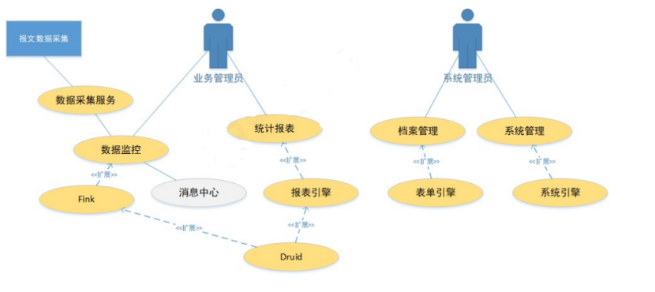
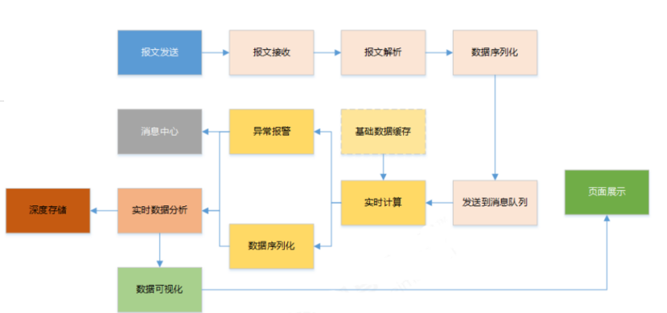

# cold-chain-monitor
冷链温度实时监控系统
# 1. 业务背景

## 1.1 物流行业

物流是指从供应地向接收地的实体流动过程。根据实际需要，将运输、储存、装卸、搬运、包装、流通、加工、配送、信息处理等基本功能实施有机结合。

## 1.2 冷链行业

冷链（cold chain）是指某些食品原料、经过加工的食品或半成品、特殊的生物制品和药品在经过收购、加工、灭活后，在产品加工、贮藏、运输、分销和零售、使用过程中，其各个环节始终处于产品所必需的特定低温环境下，减少损耗，防止污染和变质，以保证产品食品安全、生物安全、药品安全的特殊供应链系统。

## 1.3 冷链监控

因为在冷链物资流转过程中，对物资的生产、运输、存储、销售时的温度、湿度等各种指标要求比较高，为了减轻人工成本、提高设备检测的可靠性，需要专门的软件系统来进行系统化、自动化操作。

冷眼物流设备监控系统是一款应用于对食品、药品冷链仓储、运输的环节中针对温度、湿度、电量等进行监控、预警和统计分析的系统。

# 2.系统架构
## 2.1系统用例图


## 2.2任务流程图


## 2.3微服务拆分
| 应用           | 端口   | 说明                     | 启动命令                                               |
|----------------|--------|--------------------------|-------------------------------------------------------|
| cold-eureka    | 8001   | 服务注册中心             | `java -jar cold-eureka-0.0.1-SNAPSHOT.jar &`          |
| cold-gateway   | 8080   | API网关，前端统一入口     | `java -jar cold-gateway-0.0.1-SNAPSHOT.jar &`         |
| cold-user      | 8185   | 用户服务                 | `java -jar cold-user-1.0.0.jar &`                     |
| cold-admin     | 8181   | 管理服务                 | `java -jar cold-admin-0.0.1-SNAPSHOT.jar &`           |
| cold-druid     | 8182   | Druid查询服务            | `java -jar cold-druid-1.0.0.jar &`                    |
| cold-monitor   | 8183   | 实时查询服务             | `java -jar cold-monitor-0.0.1-SNAPSHOT.jar &`         |
| cold-jobs      | 8184   | 定时任务服务             | `java -jar cold-jobs-0.0.1-SNAPSHOT.jar &`             |
| cold-netty-server | 10010 | netty服务器             | `java -jar cold-netty-server-1.0-SNAPSHOT.jar`        |
| cold-ui        | 8000   | web服务，Tomcat          | `service tomcat start | stop | restart`                |


# 3.项目核心职责（cold-druid）


### **3.1实时数仓构建**
- **Kafka-Druid管道实现**
    - 配置Druid Kafka Supervisor实时消费流程，关键参数：
      ```json
      "segmentGranularity": "DAY",      // 按天分片存储
      "queryGranularity": "NONE",        // 保留原始数据精度
      "maxRowsPerSegment": 5000000      // 控制单文件大小
      ```
    - 解决时区问题：修改Druid所有组件JVM时区配置（`-Duser.timezone=UTC+8`）
    - 数据可靠性保障：元数据持久化至MySQL

---

### **3.2数据服务开发**
- **RESTful接口开发**
    - 实现设备温湿度查询接口（`/temhum`）：
      ```java
      
      public R queryDruidTumHum(Map<String, Object> params) {
          // 1. 生成Druid SQL查询设备数据
          // 2. 时间戳格式化：20191121094607 → "09:46:07"
          // 3. 返回结构：{xAxis:["09:46:07",...], tem:[-30,...], hum:[24,...]}
      }
      ```
    - 支持多维度筛选：设备编号（`meterCode`）、时间范围（`startTime/endTime`）
- **Druid连接管理**
    - 封装`DruidHelper`工具类，提供连接池及安全关闭机制

---

### **3.3存储架构设计**
- **MySQL报警表设计**  
  | 字段 | 类型 | 约束 | 作用 |  
  |---|---|---|---|  
  | `meterCode` | VARCHAR(50) | 主键 | 设备唯一标识 |  
  | `curtime` | VARCHAR(14) | 联合索引`(curtime, state)` | 精确到秒的事件时间 |  
  | `state` | TINYINT |  | 设备状态（0停用/1正常/2异常） |  
  

- **Druid数据模型**
    - 维度定义：设备ID/温度/湿度/地理位置等20+字段
    - 时间序列：`curtime`字段配置为时间主维度（`"timestampSpec"`）

---

### **3.4运维部署**
- **集群环境搭建**
    - 部署Zookeeper 3.5 + Kafka 2.3集群
    - 配置Druid单机模式（Small类型），调整组件内存分配
- **数据管道监控**
    - 通过Druid控制台（`http://ip:8888`）监控实时数据摄入状态
    - 日志跟踪：Kafka消费偏移量检查 + Druid任务异常告警

---

### **技术亮点**
| 模块 | 关键技术 |  
|---|---|  
| **实时管道** | Kafka分区消费 + Druid Segment分片策略 |  
| **查询优化** | 列式存储 + 时间范围索引（`intervals`参数） |  
| **可维护性** | 配置中心化管理（Supervisor JSON模板化） |  

